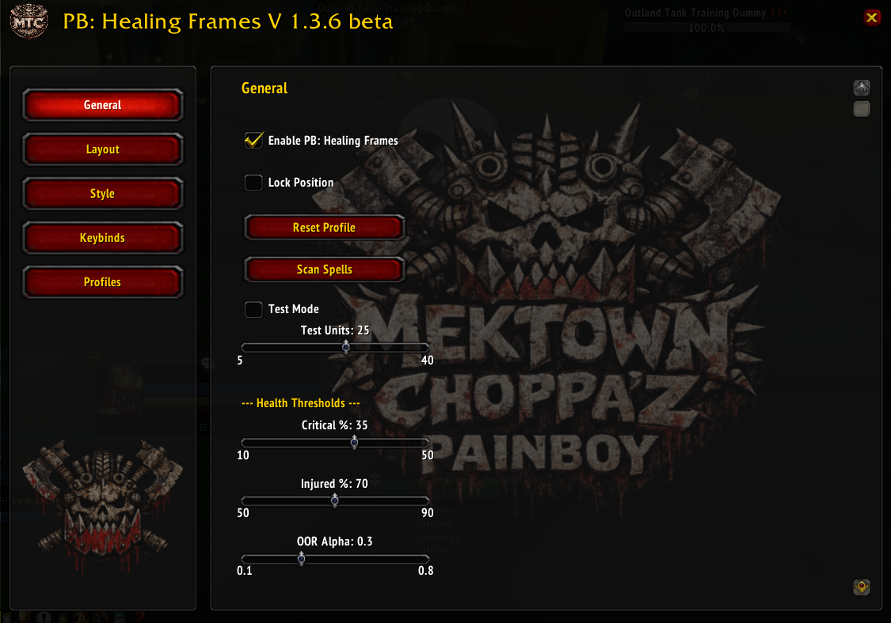
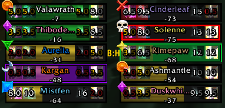
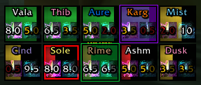
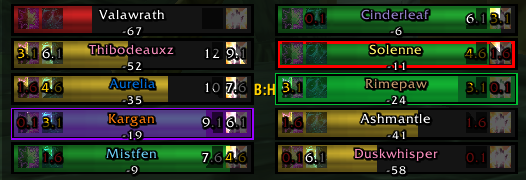
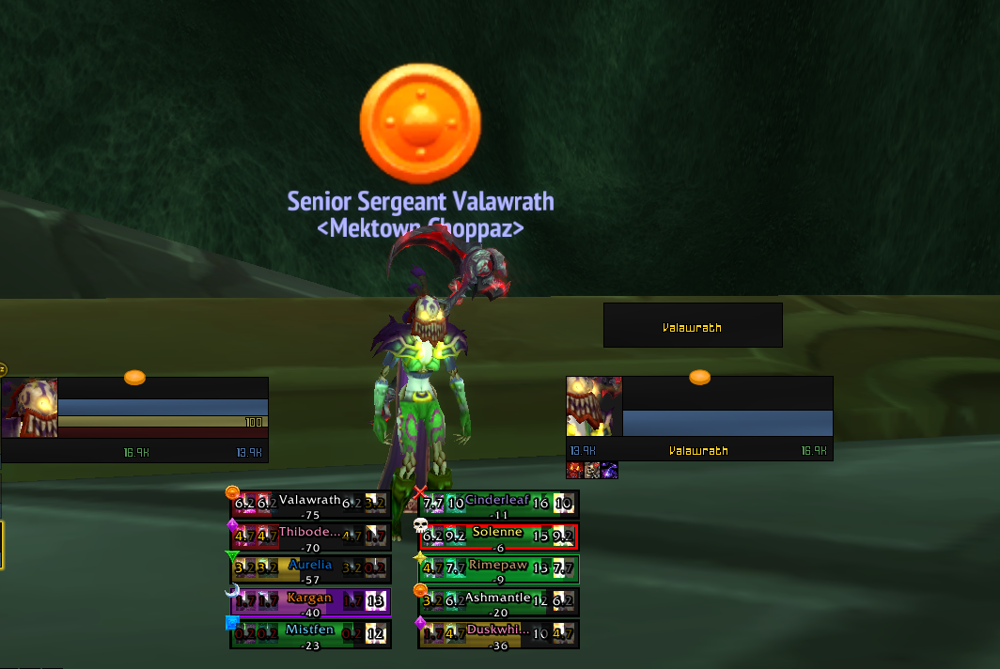
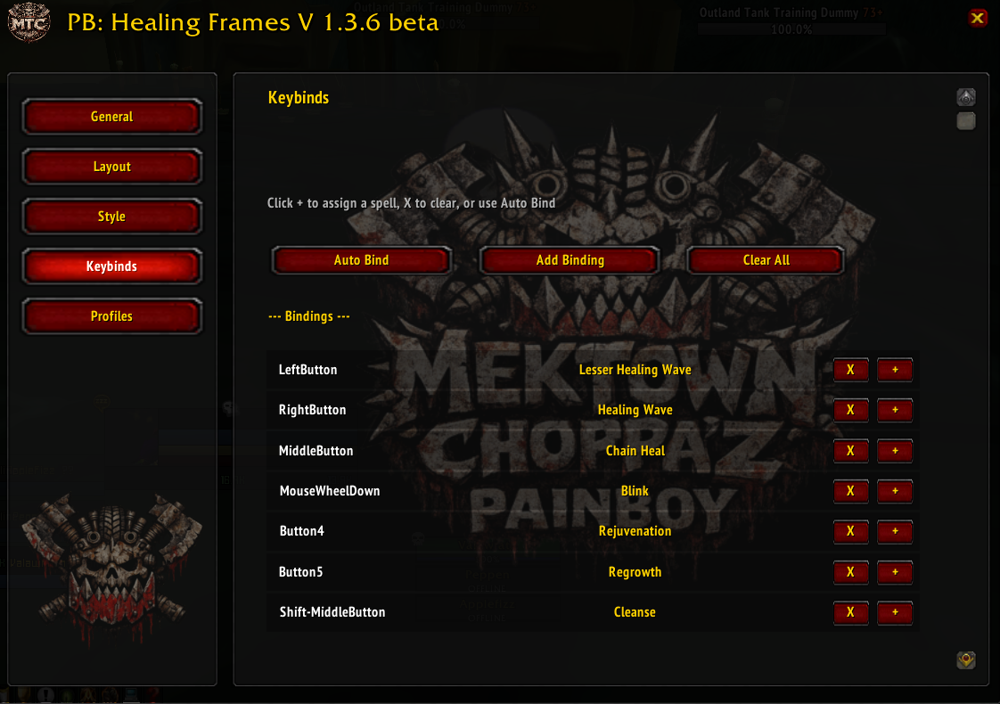

# PB: Healing Frames 🧙‍♂️

**Lightweight, Powerful Healing Unit Frames for WoW 3.3.5a**

Inspired by classic grid-based and bar-style healing interfaces, **PB: Healing Frames** provides a clean, modern, and highly configurable solution for healers. Specifically optimized for the 3.3.5a client and compatible with custom class architectures like Project Ascension.

---

## ✨ Key Features

### 🔲 Dual Layout Modes
Choose between a compact **Grid Mode** for large-scale raiding or a classic **Bars Mode** for traditional group management. Lay out each style horizontally or vertically, pick how many units appear per row, and scale every group independently without touching Lua.

### 🎨 Smart Visuals
- **Dynamic Health Colors**: Instant visual feedback with Healthy (Green), Injured (Yellow), and Critical (Red) states.
- **Curable Debuff Highlighting**: Frames change color based on the type of debuff you can personally cleanse (Magic, Curse, Disease, Poison).
- **Incoming Heal Predictions**: Full `HealComm` integration prevents over-healing.
- **Animated HoT Tracking**: Priority-based indicators hug the bar edges (2×2 on bars, 2×1 on grid) with a subtle glow so your Rejuvenations and Earth Shields are impossible to miss.
- **Raid Target Badges**: Optional raid icons pop off the top-left corner of every frame—perfect for calling out main tanks or kill targets at a glance.

### ⚡ Built-in Click-Casting
No need for external addons like Clique.
- **Auto-Bind**: One-click "Smart Bind" scans your spellbook and assigns your most important healing spells to your mouse buttons.
- **Manual Binding**: Easily assign any spell, macro, or target action to Left, Right, Middle, and extra mouse buttons.
- **Modifier Support**: Use Shift, Ctrl, and Alt modifiers to expand your available bindings per unit.

### 🧪 Advanced Setup Tools
- **Test Mode**: Spawn fake raid members with smooth, animated health swings, rotating debuffs, live HoT timers, and preview raid icons so you know exactly how the frames will behave mid-fight.
- **Spell Scanning**: Intelligent spellbook scanning ensures your newest ranks and custom abilities are always ready to be bound.

---

## 🚀 Getting Started

### Installation
1. Download the repository.
2. Place the folder into your `Interface/AddOns/` directory.
3. Ensure the folder is named exactly **`PB_HealingFrames`**.
4. Restart World of Warcraft.

### Configuration
- Type **`/pb`** or **`/pbhf`** in-game to open the main configuration window.
- First time using it? Click **"Scan Spells"** in the General tab, then go to the Keybinds tab and click **"Auto Bind"** for an instant setup.

---

## ⌨️ Slash Commands

| Command | Action |
| :--- | :--- |
| `/pb` | Open/Close configuration window |
| `/pb scan` | Force a refresh of your known spells |
| `/pb smartbind` | Run the automatic spell binding logic |
| `/pb test [5-40]` | Toggle test mode with a specific number of units |
| `/pb debug [on|off|auras <unit>]` | Enable logging or dump aura info for a unit |
| `/pb sample [on|off|export|clear]` | Collect and export aura data to share with the devs |
| `/pb lock` / `/pb unlock` | Toggle frame movement |

---

## 📸 Gallery
Click any screenshot to zoom in.

  
  
  

  
  
  

---

## 🤝 Share Ascension Aura Data
Helping us keep the HoT database current is as simple as running a sampler during your dungeon or raid:

1. Type `/pb sample on` (you’ll get a confirmation message).
2. Heal/play normally for a few minutes so the addon can see your buffs.
3. Type `/pb sample export` and copy the printed list.
4. DM the output to **Talzanar** on Discord.

Use `/pb sample off` when you’re done (and `/pb sample clear` if you want to wipe the log). Every submission helps us support more Ascension-only spells without extra guesswork.

## 🛠️ Credits & Inspirations
Inspired by the utility of Grid, the aesthetic of VuhDo, and the simplicity of HealBot. Built for healers who want maximum efficiency with minimum bloat.

**MTC: Healing Frames v1.0.0-beta** | *Developed by Sigh-Club*

---

## ☕ Buy Me a Coffee
Like the addon? Tips help keep development rolling. You can send a coffee via PayPal: **[paypal.me/talzanar](https://paypal.me/talzanar)**
